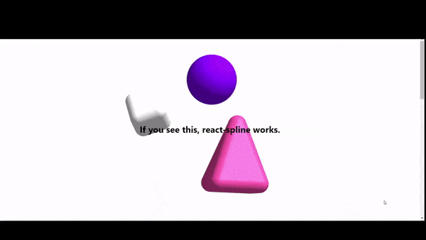

# React Spline

[](https://www.npmjs.com/package/react-spline) [](https://standardjs.com)

A painless, configurable, [spline](https://spline.design) wrapper for React to add sweet animations easily into your projects.



## Install

```bash
npm install --save react-spline
```

or

```bash
yarn add react-spline
```

## Usage

Import the `Spline` component from `react-spline` and you're set.

```tsx
import React, { Component } from 'react'

import { Spline } from 'react-spline'
import SCENE_OBJECT from './scene.json'

class Example extends Component {
  render() {
    return <Spline scene={SCENE_OBJECT} />
  }
}
```

## Props

| Property              | Description                                                              |
| --------------------- | ------------------------------------------------------------------------ |
| scene `object`        | Required. The scene object exported from Spline.                         |
| id `string`           | Default empty. Assignable HTMLAttribute `id` for the `<canvas>` element. |
| className `string`    | Default empty. Assignable HTMLAttribute `class` for the `<div>` wrapper. |
| style `JSX CSS`       | Default empty. Custom styling for the `<div>` wrapper.                   |
| canvasStyle `JSX CSS` | Default empty. Custom styling for the `<canvas>` element.                |

## Loading the Spline model
To download Spline models from the link that gets generated in Spline, it's accessible at ``https://my.spline.design/example-8b43571.../scene.json`` (**Note**: Here *example-8b43571* in the link is a placeholder for a Spline generated link). You can then import the object and use it like shown above.

## Multiple THREE.js Warning Issue
The older versions of this library experience a ~~bug~~ problem, where outdated usage of functions in the Spline runtime cause multiple duplicate warnings to clutter the console. For now, it has been disabled by a workaround script that removes duplicate warnings from the console until we have a proper solution.

## License

MIT © [utkarshdubey](https://github.com/utkarshdubey)
